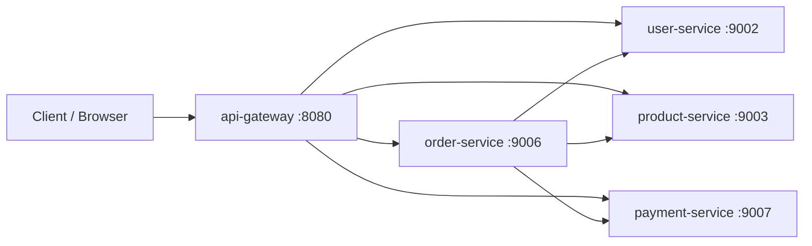
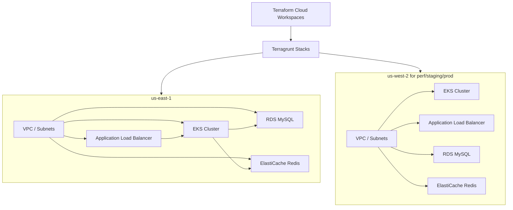
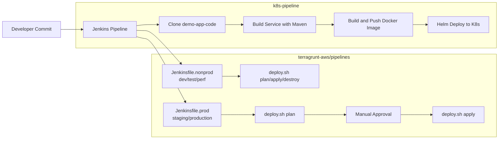

# demo_project

Unified demo workspace for application services, Kubernetes delivery pipelines, and AWS infrastructure provisioning.

## Overview

This repository contains three primary parts:

1. Application code (Spring Boot microservices)
2. CI/CD pipeline assets for Kubernetes deployments
3. Terragrunt/Terraform infrastructure-as-code for AWS

## Repository Structure

```text
demo_project/
├── demo-app-code/
├── k8s-pipeline/
├── terragrunt-aws/
└── README.md
```

## Components

### 1) Application Services

Path: [demo-app-code](demo-app-code)

Contains the demo e-commerce microservices and build tooling.

- Tech stack: Spring Boot, Maven, JDK 8
- Services: api-gateway, user-service, product-service, order-service, payment-service
- Local build and image build helpers are documented in:
  [demo-app-code/README.md](demo-app-code/README.md)

Quick build:

```bash
cd /Users/novice/Desktop/test/demo/demo_project/demo-app-code
mvn clean package
```

### 2) Kubernetes Pipeline

Path: [k8s-pipeline](k8s-pipeline)

Contains Jenkins pipelines and shell scripts to build, push, and deploy the app services.

- Non-prod pipeline: [k8s-pipeline/Jenkinsfile](k8s-pipeline/Jenkinsfile)
- Stage/prod pipeline: [k8s-pipeline/Jenkinsfile-stage-prod](k8s-pipeline/Jenkinsfile-stage-prod)
- Deployment/chart assets: [k8s-pipeline/demo-app-helm](k8s-pipeline/demo-app-helm)
- Full usage guide: [k8s-pipeline/README.md](k8s-pipeline/README.md)

### 3) AWS Infrastructure (Terragrunt)

Path: [terragrunt-aws](terragrunt-aws)

Contains reusable Terraform modules and Terragrunt stacks for:

- network
- eks
- load-balancer
- rds-mysql
- redis

Includes:

- pipeline definitions under [terragrunt-aws/pipelines](terragrunt-aws/pipelines)
- deploy scripts under [terragrunt-aws/pipelines/scripts](terragrunt-aws/pipelines/scripts)
- environment stacks under [terragrunt-aws/terragrunt](terragrunt-aws/terragrunt)

Start here for infra setup and run instructions:
[terragrunt-aws/README.md](terragrunt-aws/README.md)

## Application Design Diagram



## Infrastructure Design Diagram



## Pipeline Design Diagram



## Recommended Workflow

1. Build and validate application modules in [demo-app-code](demo-app-code).
2. Build/push and deploy application workloads via [k8s-pipeline](k8s-pipeline).
3. Provision or update infrastructure using [terragrunt-aws](terragrunt-aws).

## Prerequisites (Workspace Level)

- Git
- Java 8 and Maven 3.8+
- Docker
- Jenkins (for CI/CD pipelines)
- kubectl and Helm (for Kubernetes deployment)
- Terraform and Terragrunt (for infrastructure)
- AWS and Terraform Cloud access (for terragrunt-aws remote runs)

## Notes

- This README is the top-level index for the workspace.
- Component-specific operational details are maintained in each component README.
